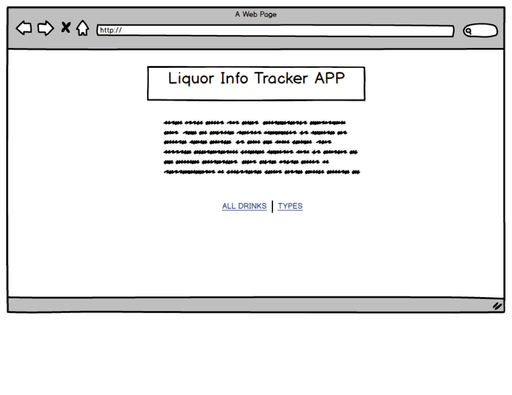

# Liquors on Track

Link: https://liquor-tracker.herokuapp.com/

## Challenge

To create a CRUD app to keep on track and organize liquors conveniently in inventories at home or commercial sales places.

## Technologies

* Javascript ES6
* Node.js/ Express
* EJS
* PostgreSQL
* CSS

## Install & Run

1. Clone the repository
2. `npm install`
3. run `nodemon server.js` to play

## Included Features

* Allowing user to organize liquors by categories with specific ID given.
* User can add more specific information of liquor img URL, name, proof, size, left amount of liquors and location.
* User can view liquors by viewing all page and single categorized page.

## CRUD Algorithm

This is my frist CRUD app project I made by using Javascript ES6/EJS for the front-end and Node.js(Express)/PostgreSQL for the back-end. I used two models category and liquor by creating two tables in PostgreSQL. And used Node.js(Express) for the backend  to connect data written in PostgreSQL with front-end written in EJS. Different files of EJS showing different pages of liquors. All liquors page shows all liquors by names and in a time order. The single page shows the each different information about different liquors. It can be accessed by clicking the name of liquors in all liquors page. User can either delete or edit information of specific liquor by clicking the buttons in single page. Category page shows the simply 5 different categories of liquors such as wine, cognac, whiskey, vodka and tequilia. By clicking the different categories, the page views the all the liquors with its certain category. different different categories by different category ID, create page, edit page and delete function.

## Wireframes:

